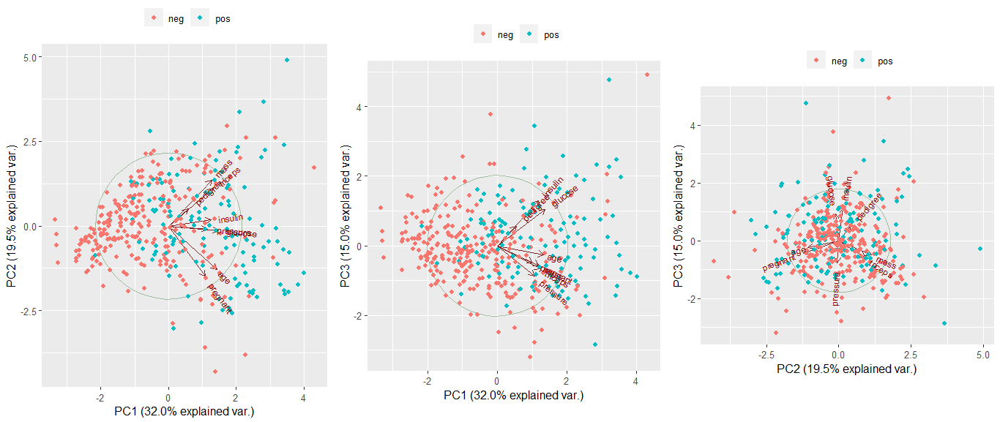

# Ejercicio 2: Clasificación supervisada

```{r setup, include=FALSE}
#Empezamos limpiando nuestro ambiente
rm(list = ls(all.names = TRUE))

library(ISLR)       # Para la base de datos
# Cargamos la base de datos PimaIndiansDiabetes2 del paquete mlbench
library(tidyverse)
library(knitr)
library(dplyr)      # Para el manejo de datos
library(kableExtra)
library(mlbench)
library(ggplot2)
library(GGally)
library(factoextra)
library(cowplot)
library(caret) # Para realizar holdout method
library(MASS) # Metodo LDA/ Metodo QDA
library(metrica)
library(Matrix)
library(glmnet)
library(e1071) # Metodo naive classifer
library(class) # Para metodo K-NN
library(randomForest) # Metodo random Forest
library(ranger)
library(ggbiplot)  #GRaficas de componentes principales
library(psych) #Componentes principales
```

La base de datos \text{PimaIndiansDiabetes2}, proviene del Instituto Nacional de Diabetes y Enfermedades Digestivas y Renales. El objetivo del conjunto de datos es predecir de forma diagnóstica si un paciente tiene diabetes o no, basándose en ciertas mediciones de diagnóstico incluidas en el conjunto de datos. Se impusieron restricciones, en particular, todas las pacientes de esta base de datos son mujeres de al menos 21 años de edad de ascendencia india Pima.

```{r datos, include=FALSE}
data(PimaIndiansDiabetes2)
# Quitamos observaciones con NA
datos <- na.omit(PimaIndiansDiabetes2)
dim(datos)
str(datos)
datos$diabetes<-as.factor(datos$diabetes)
```

## Analisis descriptivo de los datos

Se realizó un analisis descriptivo de los datos para visualizar medidas de tendencia central y de dispersión. Estas se muestran en el Cuadro \ref{tab:analisis}

```{r analisis, include=TRUE, echo=FALSE, warning=FALSE, results='asis'}

analisis <- data.frame(
  pregnant = c(0.0,1.0,2.0,3.3,5.0,17.0),
  glucose = c(56,99,119,123,143,198),
  pressure = c(24.0,62.0,70.0,70.7,78.0,110.0),
  triceps = c(7.0,21.0,29.0,29.1,37.0,63.0),
  insulin = c(14.0,76.8,125.5,156.1,190.0,846.0),
  mass = c(18.2,28.4,33.2,33.1,37.1,67.1),
  pedigree = c(0.085,0.270,0.450,0.523,0.687,2.420),
  age = c(21.0,23.0,27.0,30.9,36.0,81.0)
)

# Nombramos las filas de nuestra tabla
row.names(analisis) <- c("Min.",
                                     "1st Qu.",
                                     "Median",
                                     "Mean",
                                     "3rd Qu.",
                                     "Max.")
  
kable(analisis, booktabs = T, 
        align = "c", 
        linesep = "", 
        caption = "Análisis descriptivo de las variables predictoras") %>% 
  kable_styling(latex_options = "HOLD_position")
```

Ademas se realizaron graficos para visualizar mejor los datos

```{r graficas, include=FALSE}
#Graficamos diabetes vs. pregnant
a_1<-ggplot(data = datos,aes(x = diabetes, y = pregnant)) +
  geom_boxplot( aes(fill= diabetes)) +
  ggtitle("Diabetes vs. pregnant") +
  scale_y_continuous(breaks = seq(0,18,2),limits = c(0,18)) +
  stat_summary(fun.y=mean, colour="darkred", geom="point", 
               shape=18, size=3,show.legend = TRUE) +
  theme_gray() + 
  theme_update(plot.title = element_text(hjust = 0.5))


#Graficamos diabetes vs. glucosa
a_2<-ggplot(data = datos,aes(x = diabetes, y = glucose)) +
  geom_boxplot( aes(fill= diabetes)) +
  scale_y_continuous(breaks = seq(80,200,10),limits = c(80,200)) +
  ggtitle("Diabetes vs. Glucosa") +
  stat_summary(fun.y=mean, colour="darkred", geom="point", 
               shape=18, size=3,show.legend = TRUE) +
  theme_gray() + 
  theme_update(plot.title = element_text(hjust = 0.5))

#Graficamos diabetes vs. glucosa
a_3<-ggplot(data = datos,aes(x = diabetes, y = pressure)) +
  geom_boxplot( aes(fill= diabetes)) +
  scale_y_continuous(breaks = seq(20,115,10),limits = c(20,115)) +
  ggtitle("Diabetes vs. Presión diastolica") +
  stat_summary(fun.y=mean, colour="darkred", geom="point", 
               shape=18, size=3,show.legend = TRUE) +
  theme_gray() + 
  theme_update(plot.title = element_text(hjust = 0.5))

#Graficamos diabetes vs. triceps
a_4<-ggplot(data = datos,aes(x = diabetes, y = triceps)) +
  geom_boxplot( aes(fill= diabetes)) +
  scale_y_continuous(breaks = seq(10,65,10),limits = c(10,65)) +
  ggtitle("Diabetes vs. tríceps") +
  stat_summary(fun.y=mean, colour="darkred", geom="point", 
               shape=18, size=3,show.legend = TRUE) +
  theme_gray() + 
  theme_update(plot.title = element_text(hjust = 0.5))

#Graficamos diabetes vs. insulin
a_5<-ggplot(data = datos,aes(x = diabetes, y = insulin)) +
  geom_boxplot( aes(fill= diabetes)) +
  scale_y_continuous(breaks = seq(10,850,100),limits = c(10,850)) +
  ggtitle("Diabetes vs. insulin") +
  stat_summary(fun.y=mean, colour="darkred", geom="point", 
               shape=18, size=3,show.legend = TRUE) +
  theme_gray() + 
  theme_update(plot.title = element_text(hjust = 0.5))

#Graficamos diabetes vs. mass
a_6<-ggplot(data = datos,aes(x = diabetes, y = mass)) +
  geom_boxplot( aes(fill= diabetes)) +
  scale_y_continuous(breaks = seq(20,70,10),limits = c(20,70)) +
  ggtitle("Diabetes vs. IMC ") +
  stat_summary(fun.y=mean, colour="darkred", geom="point", 
               shape=18, size=3,show.legend = TRUE) +
  theme_gray() + 
  theme_update(plot.title = element_text(hjust = 0.5))
#Graficamos diabetes vs. pedigree
a_7<-ggplot(data = datos,aes(x = diabetes, y = pedigree)) +
  geom_boxplot( aes(fill= diabetes)) +
  scale_y_continuous(breaks = seq(0,2.5,0.5),limits = c(0,2.5)) +
  ggtitle("Diabetes vs. Pedigree") +
  stat_summary(fun.y=mean, colour="darkred", geom="point", 
               shape=18, size=3,show.legend = TRUE) +
  theme_gray() + 
  theme_update(plot.title = element_text(hjust = 0.5))
#Graficamos diabetes vs. age
a_8<- ggplot(data = datos,aes(x = diabetes, y = age)) +
  geom_boxplot( aes(fill= diabetes)) +
  scale_y_continuous(breaks = seq(20,60,10),limits = c(20,60)) +
  ggtitle("Diabetes vs. Edad") +
  stat_summary(fun.y=mean, colour="darkred", geom="point", 
               shape=18, size=3,show.legend = TRUE) +
  theme_gray() + 
  theme_update(plot.title = element_text(hjust = 0.5))

```

```{r boxp, fig.width=9, fig.height=4, echo=FALSE, fig.cap="\\label{fig:boxp} Boxplot de Diabetes v.s. cada variable", message=FALSE, warning=FALSE, results='asis'}

plot_grid(a_1,a_2,a_3,a_4,a_5,a_6,a_7,a_8, nrow  = 2, ncol=4) 

```

Con base a la Figura \ref{fig:boxp} se observó que para el grupo de mujeres que fueron diagnosticadas con diabetes, tienen mayor concentración de glucosa en plasma. Este mismo grupo tiene mayor grosor del pliegue cutáneo del tríceps, mayores valores en 2-Hour serum insulin, además mayores valores en el indice de masa corporal (IMC) y mayor edad.

Además con esta gráfica se puede observar que las variables tienen distinta escala.

\newpage

## Componentes principales

```{r components, fig.width=4, fig.height=3,  echo=FALSE, fig.cap="\\label{fig:components} Analisis de componentes principales.", message=FALSE, warning=FALSE, results='asis'}
# usamos cor="cor" para estnarizar
CP_Est <-principal(datos[,-9], cor="cor",
                   covar = TRUE, nfactor = 8
                   , rotate = "none")
fa.diagram(CP_Est, cut = .5, digits = 2)
```

A partir de la Figura \ref{fig:components}, se observó que las variables que se encuentran relacionadas con el primer componente principal, son las variables glucose, age y triceps

Además las variables que se encuentran relacionadas con el segundo componente son las variables mass y pregnant.

La variable que se encuentra relacionada con el tercer componente es insulin, la variable que se encuentra relacionada con el cuarto componente es pedigree y variable que se encuentra relacionada con el quinto componente es pressure.

A continuación se presentan los diagramas de dispersión entre los primeros tres componentes principales coloreando las observaciones de acuerdo con los dos grupos a clasificar(diabetes=neg o diabetes=pos)

```{r grafica,include=FALSE}
R.CP=prcomp(datos[,-9], scale = TRUE)
R.CPb=prcomp(~.,datos[,-9],  scale = TRUE)

g1<-ggbiplot(R.CP, choices = c(1,2), obs.scale = 1, var.scale = 1, 
         groups = datos$diabetes, ellipse = F, 
         circle = TRUE) + scale_color_discrete(name = '') + theme(legend.direction = 'horizontal', 
                                                                  legend.position = 'top')
g2<-ggbiplot(R.CP, choices = c(1,3), obs.scale = 1, var.scale = 1, 
         groups = datos$diabetes, ellipse = F, 
         circle = TRUE) + scale_color_discrete(name = '') + theme(legend.direction = 'horizontal', 
                                                                  legend.position = 'top')

g3<-ggbiplot(R.CP, choices = c(2,3), obs.scale = 1, var.scale = 1, 
             groups = datos$diabetes, ellipse = F, 
             circle = TRUE) + scale_color_discrete(name = '') + theme(legend.direction = 'horizontal', 
                                                                      legend.position = 'top')

plot_grid(g1,g2,g3,  nrow=1 ,ncol=3) 
```

```{r grafcomp,out.width="20cm", echo=FALSE, fig.cap="\\label{fig:grafcomp} Diagramas de dispersión entre los primeros tres componentes principales", message=FALSE, warning=FALSE, results='asis'}


```

\newpage

En la Figura \ref{fig:grafcomp} notamos que a mayor valor en el componente principal 1 (PC1), tenemos mayores valores para todas las variables.

Notamos que a mayor valor en el componente principal 2 (PC2), se tienen mayores valores para las variables mass, pedigree, triceps e insulin, sin embargo se tienen valores menores en las variables pressure, glucose, age y pregnant

Se observa a mayor valor en el componente principal 3 (PC3), se tienen mayores valores para las variables pedigree, insulin y glucose, sin embargo se tienen valores menores en las variables age, pregnant, pressure, triceps y mass.

```{r GLMlogit, include=FALSE}
# ============================================
# Inciso III
# ============================================
# Interés: predecir y = datoss$diabetes

# Repeated holdout method
# B=50, train (80%) y test (20%)
B <- 50
Partition<- createDataPartition(datos$diabetes, # Variable a predecir
                                p = .80, # Parte de training
                                list = FALSE,
                                times = B)

# Modelo sin interacciones y sin cuadrados
mod1 <- glm(diabetes ~ ., data=datos,   family=binomial(link="logit"))
summary(mod1)

# Medicion del poder predictivo mod1
mod1RHM=function(x, IndTrain, Dat){
  train= IndTrain[,x]
  test = (-train)
  modtr=glm(diabetes ~ ., data=Dat[train,],   family=binomial(link="logit"))
  preda=predict(modtr, newdata = Dat[test,], type = "response")
  predb=ifelse(preda>=.5,levels( Dat$diabetes)[2],levels( Dat$diabetes)[1])
  resPod=metrics_summary(obs = Dat[test,"diabetes"], pred = predb, metrics_list=c("accuracy", "recall", "specificity"),type = 'classification')
  return(resPod[,2])
}

#Resultados
set.seed(138)
TCC.B.mod1= sapply(1:B,mod1RHM, IndTrain=Partition, Dat=datos)
(TCC.RHM.mod1=rowMeans(TCC.B.mod1))
#[1] 0.7782051 0.5630769 0.8857692

# Global accuracy
# Grupo 1 recall
# Grupo 2 specificity
```

```{r GLMlogitcuadrados,include=FALSE}
# Modelo considerando interacciones y cuadrados
mod2 <- glm(formula = diabetes ~ .^2 + I(pregnant^2)+I(glucose^2)+I(pressure^2)+I(triceps^2)+I(insulin^2)+I(mass^2)+I(pedigree^2)+I(age^2), family = binomial("logit"), data = datos)
summary(mod2)

# Medicion del poder predictivo mod2
mod2RHM=function(x, IndTrain, Dat){
  train= IndTrain[,x]
  test = (-train)
  modtr=glm(formula = diabetes ~ .^2 + I(pregnant^2)+I(glucose^2)+I(pressure^2)+I(triceps^2)+I(insulin^2)+I(mass^2)+I(pedigree^2)+I(age^2), family = binomial("logit"), data = datos)
  preda=predict(modtr, newdata = Dat[test,], type = "response")
  predb=ifelse(preda>=.5,levels( Dat$diabetes)[2],levels( Dat$diabetes)[1])
  resPod=metrics_summary(obs = Dat[test,"diabetes"], pred = predb, metrics_list=c("accuracy", "recall", "specificity"),type = 'classification')
  return(resPod[,2])
}

#resultados
set.seed(138)
TCC.B.mod2= sapply(1:B,mod2RHM, IndTrain=Partition, Dat=datos)
(TCC.RHM.mod2=rowMeans(TCC.B.mod2))
# [1] 0.8220513 0.6553846 0.9053846
```

```{r glmlogitselvar, include=FALSE}
# =============================
#  Segunda opción considerando solo lasso y liga logit
# =============================

mod3_1RHM=function(x, IndTrain, Dat){
  train= IndTrain[,x]
  test = (-train)
  Xmod3_1ttotal = model.matrix(diabetes~ .^2 + I(pregnant^2)+I(glucose^2)+I(pressure^2)+I(triceps^2)+I(insulin^2)+I(mass^2)+I(pedigree^2)+I(age^2), family = binomial("logit"), data = Dat)[,-1]
  Xmod3_1t = Xmod3_1ttotal[train, ]
  Ymod3_1t = Dat[train,"diabetes"] 
  # Aqui se tuneo el parametro lamda
  mod3_1t.lasso.tun=cv.glmnet(Xmod3_1t, Ymod3_1t, nfolds = 5, type.measure ="class", gamma = 0, relax = FALSE, family = "binomial", nlambda = 50)
  preda=predict(mod3_1t.lasso.tun, newx = Xmod3_1ttotal[test,], type = "response", s = "lambda.min")
  predb=ifelse(preda>=.5,levels( Dat$diabetes)[2],levels( Dat$diabetes)[1])
  resPod=metrics_summary(obs = Dat[test,"diabetes"], pred = predb, metrics_list=c("accuracy", "recall", "specificity"),type = 'classification')
  return(resPod[,2])
}

set.seed(138)
TCC.B.mod3_1= sapply(1:B,mod3_1RHM, IndTrain=Partition, Dat=datos)
(TCC.RHM.mod3_1=rowMeans(TCC.B.mod3_1))

# 1] 0.7800000 0.5584615 0.8907692
```

```{r glmprobit, include=FALSE}
# ============================================
# Inciso V
# ============================================

mod4<- glm(formula = diabetes ~ .^2 + I(pregnant^2)+I(glucose^2)+I(pressure^2)+I(triceps^2)+I(insulin^2)+I(mass^2)+I(pedigree^2)+I(age^2), family = binomial("probit"), data = datos)

mod4RHM=function(x, IndTrain, Dat){
  train= IndTrain[,x]
  test = (-train)
  Xmod4ttotal = model.matrix(diabetes~ .^2 + I(pregnant^2)+I(glucose^2)+I(pressure^2)+I(triceps^2)+I(insulin^2)+I(mass^2)+I(pedigree^2)+I(age^2), family = binomial("probit"), data = Dat)[,-1]
  Xmod4t = Xmod4ttotal[train, ]
  Ymod4t = Dat[train,"diabetes"] 
  # Aqui se tuneo el parametro lamda
  mod4t.lasso.tun=cv.glmnet(Xmod4t, Ymod4t, nfolds = 5, type.measure ="class", gamma = 0, relax = FALSE, family = "binomial", nlambda = 50)
  preda=predict(mod4t.lasso.tun, newx = Xmod4ttotal[test,], type = "response", s = "lambda.min")
  predb=ifelse(preda>=.5,levels( Dat$diabetes)[2],levels( Dat$diabetes)[1])
  resPod=metrics_summary(obs = Dat[test,"diabetes"], pred = predb, metrics_list=c("accuracy", "recall", "specificity"),type = 'classification')
  return(resPod[,2])
}
#Resultado
set.seed(138)
TCC.B.mod4= sapply(1:B,mod4RHM, IndTrain=Partition, Dat=datos)
(TCC.RHM.mod4=rowMeans(TCC.B.mod4))

# [1] 0.7661538 0.5107692 0.8938462

```

```{r naicla, include=FALSE}
# Inciso VI
# =============================
#      Naive classifier       |
# =============================

# Modelo
mod5 <- naiveBayes(diabetes ~ ., datos)

# Medicion del poder predictivo mod5
mod5RHM=function(x, IndTrain, Dat){
  train= IndTrain[,x]
  test = (-train)
  modt <-  naiveBayes(diabetes ~ ., Dat[train,])
  predb=predict(modt, Dat[test,])
  resPod=metrics_summary(obs = Dat[test,"diabetes"], pred = predb, metrics_list=c("accuracy", "recall", "specificity"),type = 'classification')
  return(resPod[,2])
}

# Resutaldos
set.seed(138)
TCC.B.mod5= sapply(1:B,mod5RHM, IndTrain=Partition, Dat=datos)
(TCC.RHM.mod5=rowMeans(TCC.B.mod5))

# [1] 0.7661538 0.6384615 0.8300000
```

```{r LDA, include=FALSE}

# =============================
#         Modelo LDA           |
# =============================

# Medicion del poder predictivo mod6
mod6RHM=function(x, IndTrain, Dat){
  train= IndTrain[,x]
  test = (-train)
  mod6t <- lda(diabetes ~ ., Dat[train,])
  mod6pt=predict(mod6t, Dat[test,])
  predb=mod6pt$class
  resPod=metrics_summary(obs = Dat[test,"diabetes"], pred = predb, metrics_list=c("accuracy", "recall", "specificity"),type = 'classification')
  return(resPod[,2])
}

# REsultados
set.seed(138)
TCC.B.mod6= sapply(1:B,mod6RHM, IndTrain=Partition, Dat=datos)
(TCC.RHM.mod5=rowMeans(TCC.B.mod5))
# [1] 0.7661538 0.6384615 0.8300000

```

```{r QDA, include=FALSE}

# =============================
#         Modelo QDA           |
# =============================


# Medicion del poder predictivo mod7
mod7RHM=function(x, IndTrain, Dat){
  train= IndTrain[,x]
  test = (-train)
  mod7t <- qda(diabetes ~ ., Dat[train,])
  mod7pt=predict(mod7t, Dat[test,])
  predb=mod7pt$class
  resPod=metrics_summary(obs = Dat[test,"diabetes"], pred = predb, metrics_list=c("accuracy", "recall", "specificity"),type = 'classification')
  return(resPod[,2])
}

# REsultado
set.seed(138)
TCC.B.mod7= sapply(1:B,mod7RHM, IndTrain=Partition, Dat=datos)
(TCC.RHM.mod7=rowMeans(TCC.B.mod7))
# [1] 0.7733333 0.6161538 0.8519231

```

```{r KNN, include=FALSE}

# =============================
#   Modelo K-NN (Categorico)  |
# =============================
# Se tuneo un valor de K


# Medicion del poder predictivo, se debe incluir tuneo de k
mod8aRHM=function(x, IndTrain, Dat){
  train= IndTrain[,x]
  test = (-train)
  Xmod8ttotal = model.matrix(diabetes~ ., data=Dat)[,-1]
  Xmod8t = Xmod8ttotal[train, ]
  Xmod8test = Xmod8ttotal[test, ]
  Ymod8t = Dat[train,"diabetes"] 
  # Aqui se tuneo el parametro K
  knn.crosst <- tune.knn(x = Xmod8t, y = Ymod8t, k = 1:20,tunecontrol=tune.control(sampling = "cross"), cross=5)
  predb=knn(train=Xmod8t, test=Xmod8test, Ymod8t, k = knn.crosst$best.parameters[[1]], use.all = TRUE)
  resPod=metrics_summary(obs = Dat[test,"diabetes"], pred = predb, metrics_list=c("accuracy", "recall", "specificity"),type = 'classification')
  return(resPod[,2])
}

# Resultados
set.seed(138)
TCC.B.mod8a= sapply(1:B,mod8aRHM, IndTrain=Partition, Dat=datos)
(TCC.RHM.mod8a=rowMeans(TCC.B.mod8a))
# [1] 0.7592308 0.5307692 0.8734615

```

```{r randforest, include=FALSE}
# ============================================
#       Inciso VII: random forest 
# ============================================

# Misma malla que tomo Gonzalo

mallamtry=seq(1,13,2)
mallantree=c(200)
mallanodesize=c(1)

# con tuneo del Hiperparametro "mtry" usando tune.randomForest con 5-CV
mod9tunRHM=function(x, IndTrain, Dat){
  train= IndTrain[,x]
  test = (-train)
  tunRFt9CV=tune.randomForest(diabetes ~ .,data=Dat[train,],importance = F, mtry=mallamtry, 
                              ntree=mallantree,nodesize=mallanodesize, 
                              tunecontrol = tune.control(sampling = "cross", cross = 5))
  
  RFt=randomForest(diabetes ~ ., data = Dat[train,], mtry = tunRFt9CV$best.parameters[[2]], importance = F,
                   ntree = tunRFt9CV$best.parameters[[3]], nodesize=tunRFt9CV$best.parameters[[1]])
  predb=predict(RFt,newdata=Dat[test,], type="class")
  resPod=metrics_summary(obs = Dat[test,"diabetes"], pred = predb, metrics_list=c("accuracy", "recall", "specificity"),type = 'classification')
  return(resPod[,2])
}

set.seed(138)
TCC.B.mod9tun= sapply(1:B,mod9tunRHM, IndTrain=Partition, Dat=datos)
(TCC.RHM.mod9tun=rowMeans(TCC.B.mod9tun))
# [1] 0.7735897 0.5961538 0.8623077

```

```{r metrics, echo=FALSE, warning=FALSE, results='asis'}

metricas <- data.frame(
  Esquema_Entrenamiento = c("Reg. Log. Efectos principales", 
                    "Reg. Log. efectos principales, iteraciones y cuadrados",
                    "Reg. Log. con selección usando lasso (K-CV)",
                    "G.L.M. selección con liga probit",
                    "naive classifier",
                    "LDA continuo, considerando variables binarias",
                    "QDA continuo, considerando variables binarias",
                    "Modelo K-NN (Categorico)",
                    "Random Forest (200 árboles)"),
  Tuneo = c("No","No","Valor Lambda","No","No","No", "No", "Valor K","Valor mtry"),
  accuracy = c(0.7782051,0.8220513,0.7800000,0.7661538,0.7661538,
               0.7661538, 0.7733333, 0.7592308, 0.7735897),
  recall = c(0.5630769,0.6553846,0.5584615,0.5107692,0.6384615, 
             0.6384615, 0.6161538, 0.5307692, 0.5961538),
  specificity = c(0.8857692,0.9053846,0.8907692,0.8938462,0.8300000, 
                  0.8300000, 0.8519231, 0.8734615, 0.8623077)
)

kable(metricas, booktabs = T, 
        align = "c", 
        linesep = "", 
        caption = "Análisis de las métricas de poder predictivo mediante la aplicación de diversos métodos y modelos.") %>% 
  kable_styling(latex_options = "HOLD_position")
```

De acuerdo con las métricas presentadas en el Cuadro \ref{tab:metrics} , se observa que los valores más elevados corresponden a la columna "specificity". Esto indica una mejora en la capacidad de clasificación predictiva para ese grupo, siendo el modelo "Reg. Log. efectos principales, iteraciones y cuadrados" el que exhibe el valor más alto.

No obstante, es relevante señalar que este mismo modelo también ostenta la mejor métrica predictiva global, con una tasa del 82%. Sin embargo, es pertinente destacar que la métrica "recall" muestra un valor relativamente bajo. En consecuencia, sería prudente considerar la exploración de otras métricas o la incorporación de parámetros adicionales en este esquema.

Por este motivo, se ha optado por el esquema denominado "Reg. Log. efectos principales, iteraciones y cuadrados", dado que este exhibe las tasas más elevadas de poder predictivo en las métricas calculadas. En este sentido, se observa una métrica predictiva global con una tasa del 82%, una métrica predictiva para el primer grupo con una tasa del 65%, y una tercera métrica predictiva para el segundo grupo con una tasa del 90.5%.
